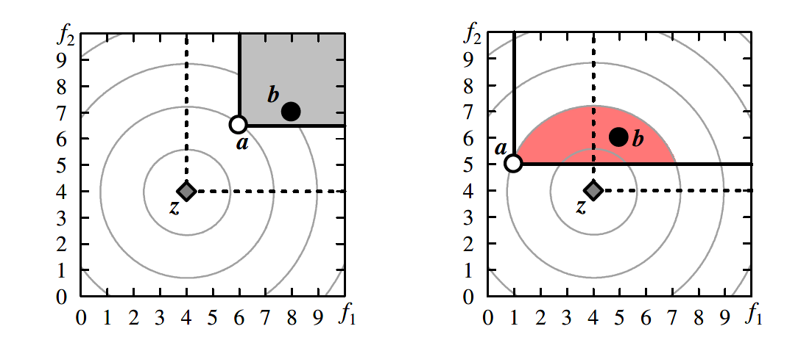
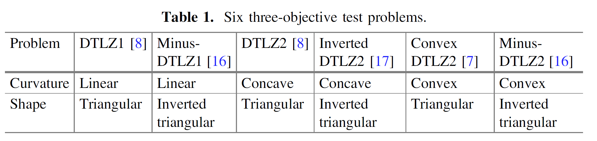

最近还在学习多目标优化，在于其他算法比较时，就会用到indicator，发现在PlatEMO平台上，HV做了归一化，而IGD并没有做归一化处理，这样可能就会出现一些不对等的信息，出现这个问题的原因之一是在计算IGD时的采样点的方法不是很好。另外最近看到了IGD的升级版-IGD+，此版本是这学期的算法课老师Hisao Ishibuchi提出，也抱着慕名的心情拜读了一下，一共分为两个论文，其一是“Modified Distance Calculation in Generational Distance and Inverted Generational Distance” 与 “Comparison of Hypervolume, IGD and IGD+ from the Viewpoint of Optimal Distributions of Solutions” 很容易看出，第一个为提出IGD+算法，然后进一步与IGD与HV进行对比。

<!--more-->

## IGD 的不足

这里有一个概念叫做：`Pareto Compliant indicator`，两个集合A与B，如果，总会有 A支配B。类似的还有`Weak Pareto Compliant indicator`，，总会有A弱支配B。目前HV是我们知道的唯一一个满足`Pareto Compliant indicator`的。IGD上面两个都不满足。

下图就是很好的例子，可以看出，A集是优于B集合的，但IGD会得出相反的结果。


于是提出了IGD+的概念

分析：在计算IGD中，会遇到两种：



左图中，，因此求出的IGD结果的结果是正确的，但相对于右图而言， 且 ，这样的IGD结果便会出现误导。

## IGD+

如图：


对于左面，没有修改；对于右面，只考虑了之间的差距。这是因为在上  优于  。数学表达式为：


其中，m为目标数，


新的IGD版本，满足`Weak Pareto Compliant indicator`，具体证明原论文有给出。

代码实现也很简单：

```matlab
function Score = IGDplus(PopObj,PF)
NP = size(PopObj,1);
res = ones(size(PF,1),1);
for i = 1:size(PF,1)
    tem = PopObj - repmat(PF(i,:),NP,1);
    tem(tem <0) = 0;
    res(i) = min(sqrt(sum(tem.*tem,2)));
end
Score    = mean(res);
end
```


## IGD, HV, IGD+ 对比

### IGD 与 IGD+


根据收敛性来说，绿色的点比紫色的点更好，IGD不可以正确表达，而IGD+可以正确表达。

### 二维分布

经过其他实验研究表面：

- 当帕累托前沿为非线性时，通过HV计算的解的最优分布取决于帕累托前沿的斜率。
- 当帕累托前沿为线性时，HV指标通过均匀分布的解得到最大。

开始实验对比：

对于HV需要一个参考点，对于二维来说，分别设置：(1, 1), (1.1, 1.1), (2, 2) 与 (10, 10)。PF分别设置线性，凸，凹。将三个指标带入SMS-MOEA算法中。


#### 线性：


在线性条件下：

- HV指标的点是均匀分布的，并且有关研究表明，当 时(是参考点的个数，r是选取的参考点)，两个极端点是被包括在其中的。
- 当Pareto前沿为线性时，通过均匀分布的解最小化IGD指标。
- 当Pareto前沿为线性时，IGD+指标似乎也被均匀分布的解最小化

因此，在线性中，三者很相似。

#### convex 与 concave


图5与6均是非线性。

- HV：最大化解集的最优分布取决于Pareto前沿的斜率。解集的紧凑度最高的地方是斜率为45°的区域。从45°斜坡开始，密度随坡度的增大或减小而减小。这样，在帕累托前缘的中心就得到了更多的解。可以观察上图5、6的(a)-(d)
  - 在convex中，在帕累托前沿的两个极端点附近的解决方案不能有较大的高压贡献。因此，即使在r = 2.0的图6(c)中，两个极值点附近也没有解。
  - 在concave中，两个极值点的HV贡献较大。如图5(b) - (d)所示。当r = 1.0作为计算HV的参考点，这两个极值点与帕累托前沿的形状无关 。这是因为当r = 1.0时，他们的HV贡献总是0。
- IGD：我们可以看到，独立于Pareto前沿形状的IGD极小化得到了相似的分布。IGD最小化是指从Pareto前沿的每个参考点到最近解的平均距离最小化。这个问题可以看作是给定参考点的聚类问题。在图4、图5和图6(e)中，给定的1,001个参考点被分成11个簇。也就是说，每个图中的Pareto front被划分为11条线或曲线。每个线段(长度约为帕累托前1/11)的非线性较弱。也就是说，即使帕累托前沿是非线性的，每个线段也类似于一条直线。因此，在图4、图5和图6(e)中得到了相似的IGD最小化分布。
- 图5和图6中一个有趣的观察结果是，(f)对于IGD+最小化的结果与(b)对于HV最大化的结果(r = 1.1)相比结果更相似。这可以通过图2(b)所示的IGD+计算机制来解释。从图2 (b)，我们可以看到，IGD +是大约的计算评估的区别真正的帕累托解集和主导地区的前面。这种差异的最小化是解集的高压的最大化。也就是说，IGD +最大化与HV最小化密切相关。因此，(f)中的IGD+极小化和(b)中的HV极大化得到了相似的解分布，如图5和图6所示。如图5(f)和图6(f)所示，在坡度接近0或90的区域，所得到的解非常接近支配区域。**因此，在这些地区不需要许多解决方案来最小化IGD+**。需要在具有45度斜度的帕累托前缘中心附近找到更多的解。两个极值点对于IGD+最小化的重要性取决于Pareto前沿的形状(即，凹或凸)。IGD+最优分布的这些特征与HV最优分布的特征相同。

### 三维分布

实验分析的测试问题为：



结果如下：


实验结果如图7、8、9、10、11、12所示。

- HV：在图7的线性三角帕累托前缘，计算HV参考点位置的影响较小。在图9中，concave三角帕累托前沿对参考点位置的影响也很小。经常使用的测试问题，如DTLZ1-4[8]和WFG4-9[11]，具有线形或凹形的三角形Pareto前沿。因此，EMO社区没有强调计算HV的参考点位置的重要性。然而，当帕累托前沿为倒三角形时(图8、10和12)，**参考点的位置对HV最大化的解的最优分布有很大的影响**。这意味着基于HV的比较结果强烈地依赖于参考点的位置。
- 在图7、8、9、10、11、12中，只有当图7中的Pareto front为线性三角形时，六种指标设置(即， HV与参考点四种设置，与IGD和IGD+)。在图8中，线性倒三角帕累托前缘，在r = 1.1, IGD, IGD+时，HV也得到了相似的结果。这些观察结果表明，当帕累托锋为线性时，三个指标的比较结果相似(当倒三角形帕累托前沿时，HV计算的参考点正确指定)。
- 如前一节所述，图7、8、9、10、11和12(e)中得到的IGD极小化解的分布是相似的(即，整个帕累托前边一致)。相反，得到的HV极大化和IGD+分布的解的分布与Pareto锋的形状有很大的关系。当r = 1.1(即所得到的HV最大值和IGD+最小值的分布是相似的。也就是说，图7、8、9、10、11、12中(b)和(f)的结果是相似的。

## 总结

区别如下：

- 当帕累托前沿为三角形时(如DTLZ1-4, WFG4-9)，参考点的位置对获得的HV最大化的最优解分布几乎没有影响或影响很小。
- 当帕累托前沿为倒三角形时(如Inverted DTLZ、Minus-DTLZ、Minus- WFG)，参考点的位置对得到的HV最大化的近似最优解分布具有主导作用。
- 当Pareto前沿为线性三角形时(如DTLZ1)，三个指标的解分布相似。
- 平均分布的解决方案总是得到的IGD最小化独立于形状的帕累托前沿。
- 当参考点不太小也不太大时，得到了与Pareto前沿形状无关的HV最大化和IGD+最小化解的相似分布。

这些观察结果表明，IGD+可作为HV的代用品。(作为整体性能指标)当HV由于计算量大而不易使用时。这也表明，IGD+和HV并不总是评价解集均匀性的好指标。虽然IGD由于其不符合Pareto imcomplain的特性，并不总是一个好的整体性能指标，但在我们的计算实验中，**IGD是一个很好的评估解决方案一致性的指标。**