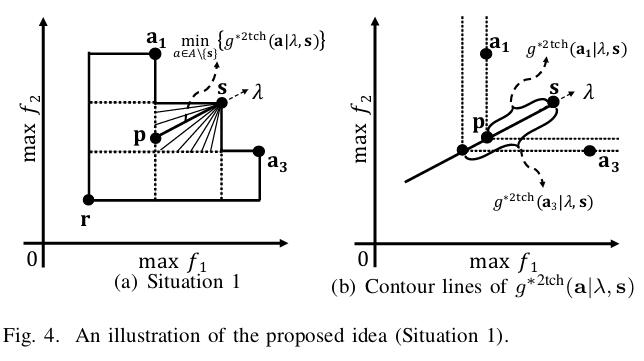

继续学习Hisao老师的论文，这次同样是两篇论文：“A new R2 indicator for better hypervolume approximation”与“R2-based Hypervolume Contribution Approximation”，首先提出R2的新计算方式，然后通过新的R2-indicator来估计“Hypervolume Contribution Approximation”，以达到近似的效果，感觉这个与之前的IGD+的目的很相似，不过可以用来indicator-based MOEAs，也是我下一个的要进行的研究话题。

<!--more-->

### Preliminary

需要介绍一些基本的几何知识。

$\lambda$ 为一个方向向量，$r^\*$为一个点。$a$ 也为一个点。

下图为二维图中(m=2)：

公式 $g^{mtch}\left(\mathbf{a} | \lambda, \mathbf{r}^{\*}\right)=\min _{j \in\{1, \ldots, m\}}\left\{\frac{\left|r_{j}^{\*}-a_{j}\right|}{\lambda_{j}}\right\}$ 对应的几何含义，蓝色为等高线，因此如果 $a$ 为两个射线上的点，那么 $g^{t e}\left(\mathbf{a} | \mathbf{w}, \mathbf{r}^{*}\right)$ 的值是相同的。

相反，如果$g^{2 t c h}\left(\mathbf{a} | \lambda, \mathbf{r}^{\*}\right)=\max _{j \in\{1, \ldots, m\}}\left\{\frac{\left|r_{j}^{\*}-a_{j}\right|}{\lambda_{j}}\right\}$ ，公式是这样的，那么等高线如下：

因此，也就是说，不在 $\lambda$ 上的 $a$，可以在不改变结果的前提下转换至在 $\lambda$ 上的某个点。如果我们有 $A={a_1, a_2, a_3}$， 和一组权重向量(红色线)，那么我们可以知道，如果选用 $g^{mtch}\left(\mathbf{a} | \lambda, \mathbf{r}^{\*}\right)=\min _{j \in\{1, \ldots, m\}}\left\{\frac{\left|r_{j}^{\*}-a_{j}\right|}{\lambda_{j}}\right\}$ ，对于$\lambda_1$来说，$a_1$ 的位置等同于 $b_1$，其他点类似，具体例子如图： 

那如果下图这样呢？正如公式$g^{2 t c h}\left(\mathbf{a} | \lambda, \mathbf{r}^{\*}\right)=\max _{j \in\{1, \ldots, m\}}\left\{\frac{\left|r_{j}^{\*}-a_{j}\right|}{\lambda_{j}}\right\}$ 所说，因为有了**绝对值**，因此 $a$ 与 $aa$ 等价，其他类似。

### R2

原来是这样的：

$$
R_{2}^{t e}\left(A, W, \mathbf{r}^{*}\right)=\frac{1}{|W|} \sum_{\mathbf{w} \in W} \min _{\mathbf{a} \in A}\left\{g^{t e}\left(\mathbf{a} | \mathbf{w}, \mathbf{r}^{*}\right)\right\}
$$
其中：
$$
g^{t e}\left(\mathbf{a} | \mathbf{w}, \mathbf{r}^{*}\right)=\max _{j \in\{1, \ldots, m\}}\left\{w_{j}\left|r_{j}^{*}-a_{j}\right|\right\}
$$

之后有人提出更有几何意义的：

$$
R_{2}^{2 t c h}\left(A, \Lambda, \mathbf{r}^{*}\right)=\frac{1}{|\Lambda|} \sum_{\lambda \in \Lambda} \min _{\mathbf{a} \in A}\left\{g^{2 t c h}\left(\mathbf{a} | \lambda, \mathbf{r}^{*}\right)\right\}​
$$

其中：
$$
g^{2 t c h}\left(\mathbf{a} | \lambda, \mathbf{r}^{*}\right)=\max _{j \in\{1, \ldots, m\}}\left\{\frac{\left|r_{j}^{*}-a_{j}\right|}{\lambda_{j}}\right\}
$$
下图为 $g^{2 t c h}\left(\mathbf{a} | \lambda, \mathbf{r}^{\*}\right)$的一个实例， $\lambda$ 穿过 $r^\*$ 与 $A$ 集合所形成的hypervolume区域相交与  $p$ 点。由上一节，我们可以得到这样结论：经过 $r^\*$ 的很多个向量与 $A$ 的边界焦点，的所有线段和(粗略的估计，呈线性关系，并非严格意义上的相等)的平均值即为hypervolume(红色的面积)。 

再之后，上图求的也不方便，于是有了下面的修改版，**注意**，$r^\*$ 变成了 $r$
$$
R_{2}^{m t c h}(A, \Lambda, \mathbf{r})=\frac{1}{|\Lambda|} \sum_{\lambda \in \Lambda} \max _{\mathbf{a} \in A}\left\{g^{m t c h}(\mathbf{a} | \lambda, \mathbf{r})\right\}
$$
其中：
$$
g^{m t c h}(\mathbf{a} | \lambda, \mathbf{r})=\min _{j \in\{1, \ldots, m\}}\left\{\frac{\left|r_{j}-a_{j}\right|}{\lambda_{j}}\right\}
$$
其几何含义：

以上皆为前人的工作，此论文主要做了一个修改，变为：
$$
R_{2}^{n e w}(A, \Lambda, \mathbf{r})=\frac{1}{|\Lambda|} \sum_{\lambda \in \Lambda} \max _{\mathbf{a} \in A}\left\{g^{m t c h}(\mathbf{a} | \lambda, \mathbf{r})\right\}^{m}
$$
其中：$g^{m t c h}$没有变化，**仅仅**是加了一个指数幂！但结果变得异常好，同时也有了较为严谨一点点的理论证明。简直为画龙点睛。

### Hypervolume Contribution Approximation

#### Background

众所周知，HV的计算公式如下：
$$
H V(A, \mathbf{r})=\mathcal{L}\left(\bigcup_{\mathbf{a} \in A}\{\mathbf{b} | \mathbf{a} \succ \mathbf{b} \succ \mathbf{r}\}\right)
$$
而对于一个点 $a$ 的hypervolume contribution 即为：
$$
C_{H V}(\mathbf{s}, A, \mathbf{r})=H V(A, \mathbf{r})-H V(A \backslash\{\mathbf{s}\}, \mathbf{r})
$$
比较形象的图为：

阴影部分一次为$a_1, a_2, a_3$的贡献值。

如果通过R2来计算的话，步骤如下：

传统方法的缺点如下：

- 为了得到一个解的超体积贡献近似，我们需要计算两个解集的R2值。超容量的贡献不能直接近似。
- 超体积的R2近似通常存在误差。因此，超体积贡献近似的误差可以被两个R2值的误差放大。因此，传统方法的逼近精度较低。
- 为了提高逼近精度，需要大量的向量来计算R2指标。因此，传统方法的计算量可以很大，从而达到很高的近似精度。

#### New method

上面的方法可以看作所有的方向向量的起点都是 $r$，这样越到后面便会越稀疏，对结果会造成影响，因此可以以 $s$ 点为焦点开始放射方向向量。如图，分两种情况：

针对这两个情况，列出不同的式子来解决这个问题。

##### First situation

第一种情况，如果要计算的 $s$ 的贡献不在边界，那么我们想要得到的情况应该如右图所示，等高线是这样的形式。
$$
L(\mathbf{s}, A, \lambda)=\min _{\mathbf{a} \in A \backslash\{\mathbf{s}\}}\left\{g^{* 2 \operatorname{th}}(\mathbf{a} | \lambda, \mathbf{s})\right\}
$$
其中，最大化问题：
$$
g^{* 2 \operatorname{tch}}(\mathbf{a} | \lambda, \mathbf{s})=\max _{j \in\{1, \ldots, m\}}\left\{\frac{s_{j}-a_{j}}{\lambda_{j}}\right\}
$$
最小化问题：
$$
g^{* 2 \operatorname{tch}}(\mathbf{a} | \lambda, \mathbf{s})=\max _{j \in\{1, \ldots, m\}}\left\{\frac{a_{j}-s_{j}}{\lambda_{j}}\right\}
$$
分析：在最大化问题中，与之前的差别在于没有了绝对值，这样便可以不考虑 $s_j < a_j$ 的那些维度，因此可以吧这些维度的坐标当作0。把原公式转化为：$a_1, p, a_1', a''_1$ 的 $g^{* 2 \operatorname{tch}}(\mathbf{a} | \lambda, \mathbf{s})$ 值是一样的(蓝色线)，无论 $a_1$ 的纵坐标如何增加。

但是如果不去掉绝对值，那么当 $a_1$ 的纵坐标大到一定程度时($b$ 高于$a_1''$ )，便会错误。紫色的便为添加绝对值后我们不想得到的等高线。

#### Second situation

第二种情况，又细分了两种(b)(c)。

- $sp_1=sr < sa_2<sa_3$
- $sp_2=sa_2<sa_3<sr$

我们知道：
$$
L(\mathbf{s}, \mathbf{r}, \lambda)=g^{\mathrm{mtch}}(\mathbf{r} | \lambda, \mathbf{s})
$$
其中：
$$
g^{\operatorname{mtch}}(\mathbf{r} | \lambda, \mathbf{s})=\min _{j \in\{1, \ldots, m\}}\left\{\frac{\left|s_{j}-r_{j}\right|}{\lambda_{j}}\right\}
$$
类似的分析，我们可以知道：
$$
L(\mathbf{s}, A, \mathbf{r}, \lambda)=\min \{L(\mathbf{s}, A, \lambda), L(\mathbf{s}, \mathbf{r}, \lambda)\}
$$
为什么考虑 $r$ 的时候，变成了 $g^{mtch}$。

首先，我们要保证经过我们设计的操作后，等高线还是这样的(下图红色，即$sr$长度不变)，我们可以平移 $\lambda$ 使它经过 $r$，与我们之前处理的情景像，这样就要使 $s$ 向下平移至 $s'$。这样也可以说明$ss'$是一条等高线，因此，根据preliminary中，我们要选择 $g^{mtch}$。

因此，综上：
$$
\begin{array}{l}
{R_{2}^{\mathrm{HVC}}(\mathbf{s}, A, \Lambda, \mathbf{r}, \alpha)=\frac{1}{|\Lambda|} \sum_{\lambda \in \Lambda} L(\mathbf{s}, A, \mathbf{r}, \lambda)^{\alpha}} \\
{=\frac{1}{|\Lambda|} \sum_{\lambda \in \Lambda} \min \left\{\min _{\mathbf{a} \in A \backslash\{\mathbf{s}\}}\left\{g^{* 2 \operatorname{tch}}(\mathbf{a} | \lambda, \mathbf{s})\right\}, g^{\mathrm{mtch}}(\mathbf{r} | \lambda, \mathbf{s})\right\}^{\alpha}}
\end{array}
$$

