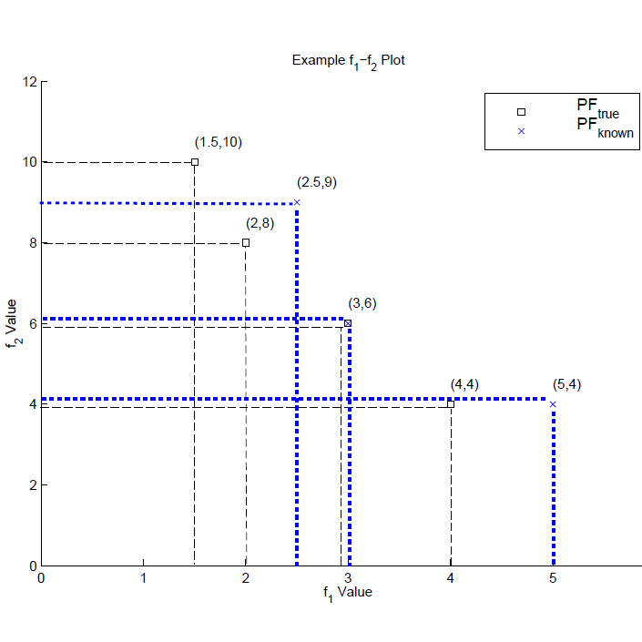

这部分要么太难，要么太简单。。。。怀疑自己智商

<!--more-->

### 介绍

基数的QIs可以归结为一个简单的概念——计算非支配解决方案的数量。基于基数的QIs所具有的一个可取(必要)的属性是，在考虑的集合中添加一个不同的非支配解决方案应该能够改进(而不是降低)评估结果。这(弱)单调的概念是一致的。下面列出了10个基数QIs(项目45-54)：

根据Pareto最优解的参与程度，基于基数的QIs可以分为两类(项目45-48和项目49-54)。

- 一种是直接考虑集合中的非支配解，例如
  - the indicators cardinality 𝐷
  - number of unique nondominated solutions
  - overall nondominated vector generation (ONVG)
  - ratio of nondominated individuals
- 另一类是比较解集中的非支配解(nondominated solutions)和问题的帕累托最优解(Pareto optimal solutions)，该类中的QIs通常返回属于帕累托最优集的非支配解与最优集大小的比值，(例如：C1，ONVG ratio）,或者或者与解集本身的比值(例如，C2，error ratio)
- 除此之外，还有其他一些指标，它们只是简单地计算属于最优集的解决方案的数量。

虽然这里描述的是对最终MOEA性能的度量，但是其中许多度量也可以用于跟踪世代总体的性能。然后，除了一个总体性能度量之外，它还指示执行期间的性能(例如，到MOEA optimu的收敛速度)。虽然使用了两个目标的例子，但是这些指标可以扩展到具有任意数量的目标维度的PF。

由于解决方案集的基数通常几乎没有与帕累托前沿的代表性相关的信息，因此通常认为它不如其他三个质量方面重要。然而，如果优化器能够找到问题的很大一部分帕累托最优解决方案，那么评估基数质量可能会变得更加合理。这对于一些组合多目标优化问题尤其适用，其中帕累托最优解的总数很小。在这类问题中，计算得到的帕累托最优解的个数是反映解集质量的可靠指标。事实上，这种评价在一些组合问题的早期研究中经常使用。

### Error ratio

此indicator与onvg与onvg ratio 出自同一本书，并且有如下定于，为了方便引用原文：

简而言之：$P$ (也就是 pareto optimal set 包含于solution set) 是针对自变量来说的 也就是decision space。

$PF$ (也就是 Pareto Front ) 是针对目标函数值来说的，也就是objective space

An MOEA reports a finite mumber of vectors in $PF_{known}$ which are or are not members of $PF_{true}$. If they are not members of $PF_{true}$ the MOEA has erred or perhaps not converged. This metric is mathematically represented by:
$$
E=\frac{\sum_{i=1}^{n}}{n}e_i
$$
where n is the number pf vectors in $PF_{known}$ and
$$
e_i = \begin{cases}
0 & if \ vector \ i,i=(1,...,n) \in PF_{true},\\
1 & otherwise
\end{cases}
$$
$E=0$，表明$PF_{known}$都在 $PF_{true}$。

$E=1$，表明$PF_{known}$中一个都不在 $PF_{true}$。

上图的值：$E=\frac{2}{3}$ 。

我们还注意到一个类似的度量，它度量由另一个 $P_{true}$ 支配的$P_{known}$ 中的解决方案的百分比。

然而，由于ER只在帕累托最优解中起作用，它可能会带来一些反直觉的情况。例如，在一个集合中添加更多的非支配解决方案可能会导致更差的分数。因此，考虑比较集本身中的非支配解可能是更好的选择，而且也不需要帕累托前沿。

### Overall Nondominated Vector Generation and Ratio(ONVG)

测试的MOEAs 每一代把 $P_{current}$ 添加到 $P_{known}$ 中，可能导致不同的数量的$P_{known}$ 。这个测量度计算的是在MOEA期间所找到的所有非支配解的数量，定义如下：
$$
ONVG = |PF_{known}|
$$
Schott 使用这个测量标准(尽管是在帕累托最优集上定义的，例如$|P_{known}|$ ) 。基因型或表现型地的定义这个测量标准可能是偏好问题，但是我们再一次注意到多个解可以映射到相同的向量上，或者换句话说，$|P_{known}| \geq |PF_{known}|$ (多对一)。尽管计算非支配解的数量可以让我们了解MOEA在生成所需解方面的有效性，但它并没有反映出$|P_{known}|$中的向量与$|PF_{known}|$ 之间的“距离”有多“远”。此外，太少的向量和$|PF_{known}|$的代表性可能很差;太多的向量可能会压倒DM。

### ONVG Ratio

很难确定$|ONVG|$的最佳值是多少。$PF_{known}$ 的基数可能在不同的计算分辨率下发生变化，也可能在拖把之间存在差异(可能是根本的)。报告$PF_{known}$的基数与离散$P_{true}$的比值可以让我们对找到的非支配向量的数量与要找到的存在向量的数量有一定的感觉。然后将这个度量定义为:
$$
ONVGR = \frac{|PF_{known}|}{|PF_{true}|}
$$
上图中，可知 $ONVG=3$，$ONVGR=0.75$。

### C1

如果已知由所有有效解组成的参考集R，那么看起来最自然的质量度量就是找到的参考点的比例。度量可以用以下方式定义：
$$
C1_R(A)=\frac{|A \cap R| }{ |R| }
$$

### C2

如果参考集不包含所有的非支配点，那么A中的被R所非支配的点集也许是属于非支配解集上的，这种情况，使用下列方法也许更可行：
$$
C2_R(A)=\frac{ | \{  u \in A | \ \nexists r \in R , r \succ u \}| }{|A|}
$$
然而，这些主要措施也有一些明显的缺点。他们对近似值的改进无动于衷。例如，考虑图11中所示的两个近似参考集，这两个近似是针对一个双目标背包问题得到的。显然，近似1比近似2好得多。近似1中的所有点都非常接近参考集，它们覆盖了参考集的大部分区域。然而，这两种近似的测度值都是相同的C1和C2。

图12中的示例说明了主要度量的另一个缺点。这两个近似由5个不占主导地位的点组成，所以它们的基数测度是相等的。然而，构成逼近3的所有点在目标空间中都是非常接近的，即它们代表了非支配前沿的同一区域。另一方面，近似值4的点分散在整个参考集合中。它们携带着丰富得多的信息，例如关于可能的目标范围的信息。这个例子表明，对于基本测度，无论它们的接近程度和关于非支配集形状的信息如何，逼近中的每个点都具有相同的权重。

### Ratio of non-dominated individuals (RNI)

这个绩效指标被定义为非主导个体的比率(RNI)对于给定的总体X，
$$
RNI(X)=\frac{nondom\_indiv}{P}
$$
nondom_indiv是种群X中非支配的个体数量，P是种群X的大小。因此，RNI = 1的值表示种群中所有的个体都是不受支配的，RNI = 0表示种群中没有一个个体是非支配的。由于通常需要大于零的总体大小，所以在$0 \leq RNI \leq 1$的范围内总有至少一个非支配个体。