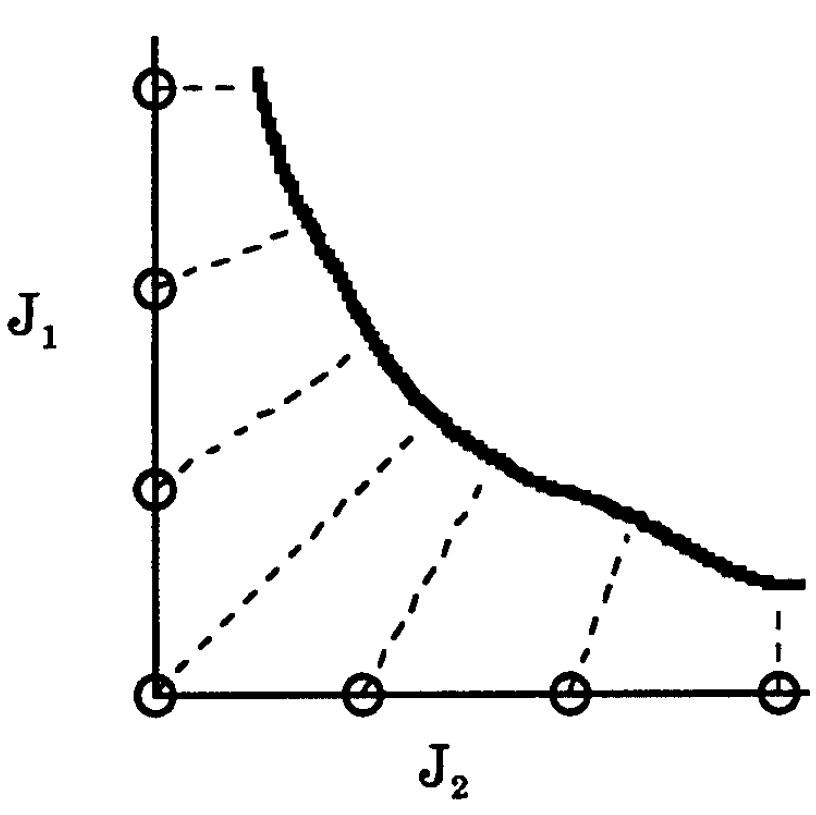
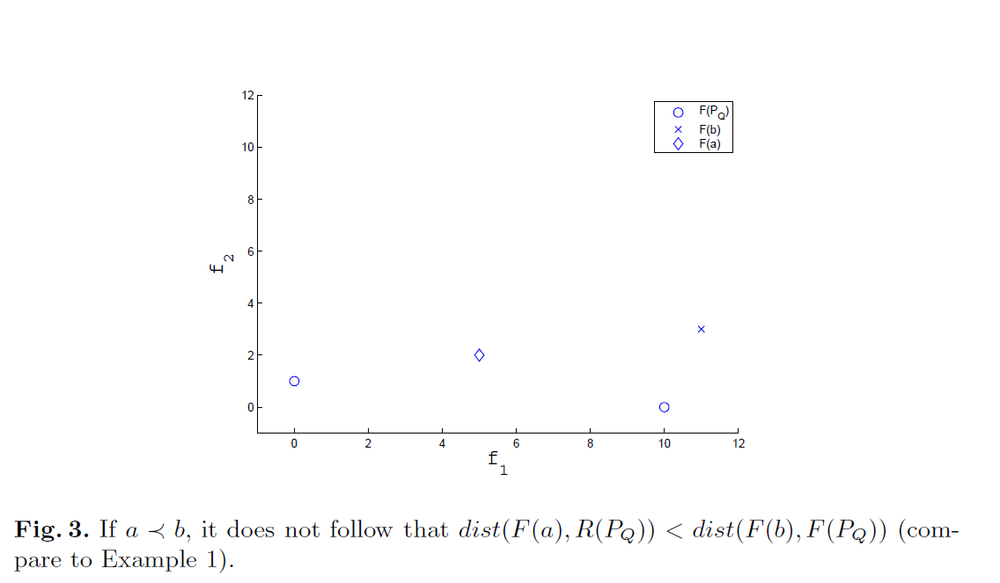
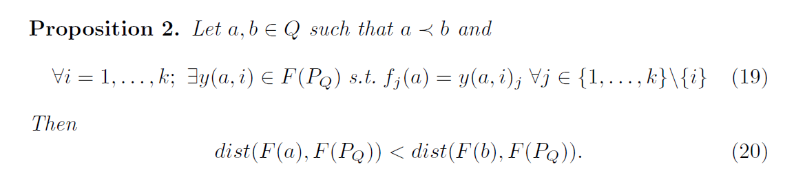
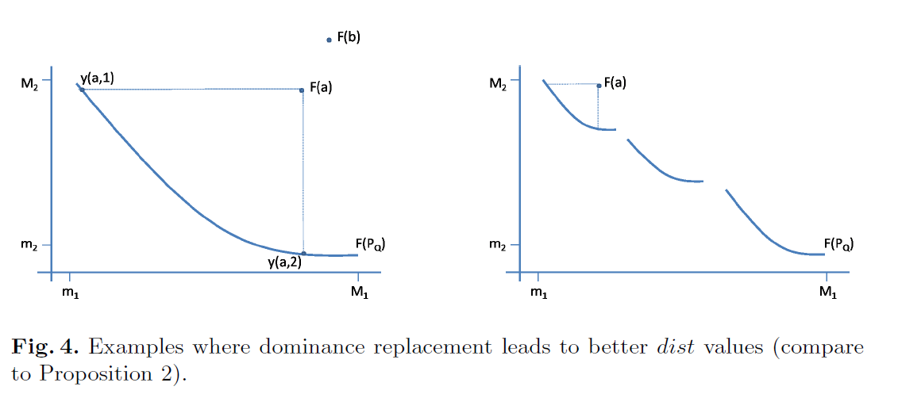
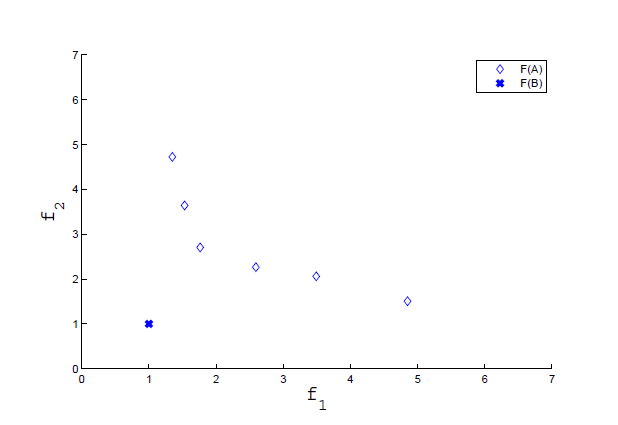
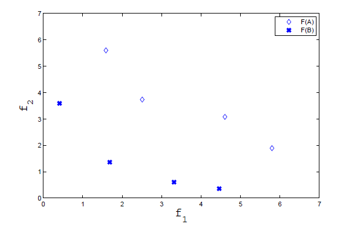
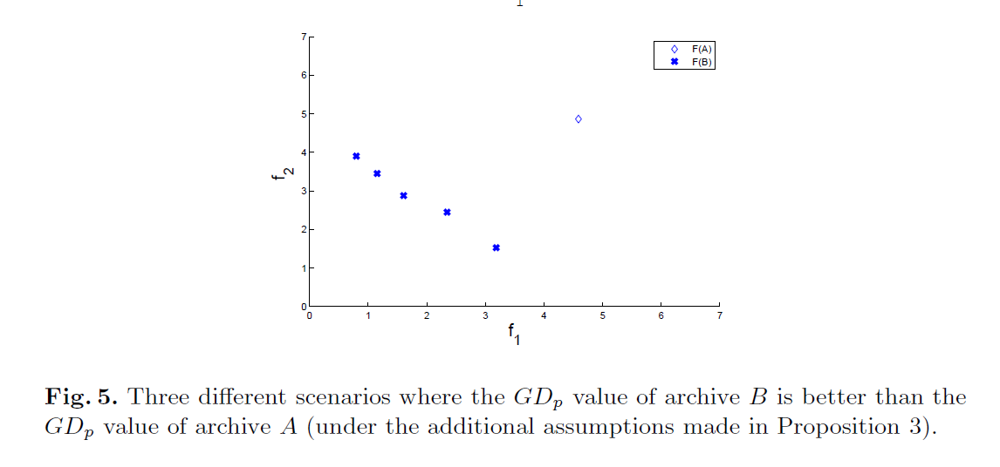
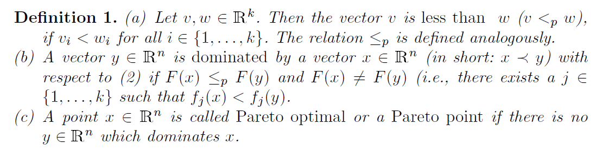
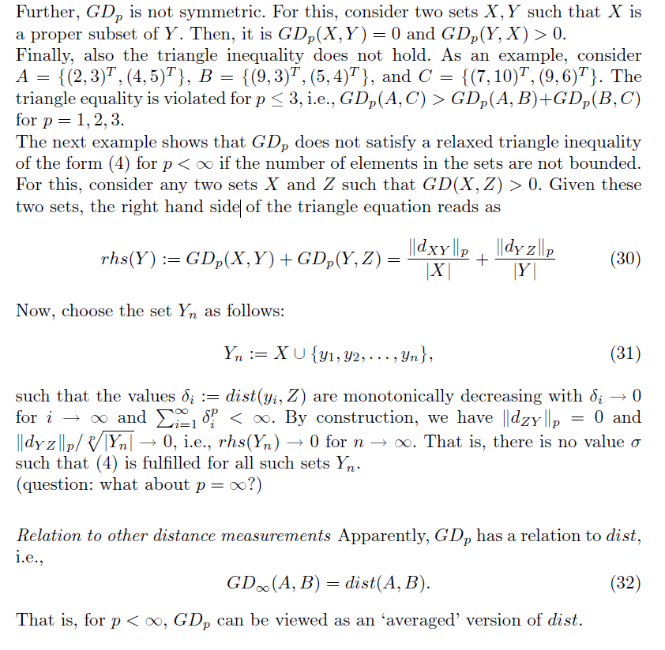

可谓呕心沥血，翻译的累死我了，这篇是关于收敛性的indicators的《Distance-based QIs》。

<!--more-->

## 分类

可以进一步分为两类：

- 测量所考虑的解集到从帕累托前缘导出的一个或多个特定点的距离：**the ideal point**, **knee point(s)** , **the Zeleny point** and **the seven particular points**。
  - the ideal point是由帕累托前缘各目标的最优值所构造的点。
  - knee point(s)是帕累托前缘上的点，它具有从相邻点计算出的最大反射角。
  - the Zeleny point是通过分别最小化每个目标得到的点。
  - the seven particular points是由二元多目标问题的帕累托前缘的理想点和极值点导出的7个特殊点
- 测量到一个很好地表示帕累托前沿的reference set的距离。在这一组中，最常用的指标是GD。GD首先计算解集中每个解到参考集中最近点的欧氏距离，然后求所有这些距离的二次平均值。这一组中的其他QIs可以看作是GD的变体，例如**taking the arithmetic mean of the distances**，**the power**
  **mean**，**considering the Tchebycheff distance**，**introducing the dominance relation between solutions and points in the reference set**。

## measure the distance of the considered solution set to one or several particular points derived from the PF

### Tchebycheff distance to the knee point

$$
d(z,z^*,\lambda)=\max_{1 \leq j \leq k}\{ \lambda_j |z_j^* - z_j| \}
$$

其中：

k：目标函数的数量。

$\lambda_i=\frac{1}{R_i}$，$R_i$是第i个目标函数的范围(range)。

Defined this way, the knee of the Pareto front is the point in the feasible objective
space, $ \Lambda$, which corresponds to $ \min_{z∈\Lambda} d(z, z^∗, \lambda)$.

如果一个偏好关系的$PF_{approx}$集合比另一个关系的$PF_{approx}$集合包含更多的膝关节周围的解，则该偏好关系优于其他关系。

### Seven point average distance

该问题用于二元目标优化。

如果有效集的先验知识是可用的，MCGA完全解析E的能力可以很精确的理解为它与个体的标准和其他(已决定的)点有多接近。由于E对于任何一个测试问题都是未知的，因此为每个问题生成7点法，以衡量算法的有效性。个体准则最优约束了两个标准问题的有效集，但也可通过单独优化每一个准则而不考虑另一个准则来求出个体准则最优。有了这两点，七点法再$J_1-J_2$被定义如下原点[0,1]，最大点(在E范围内)[0,$J_2^{worst}$]和[$J_1^{worst}$,0]，和在原点与最大值之间的每个轴上的两个点。

原文：

With the resulting two points at hand, the seven comparison points are denned on $J_1-J_2$as the origin [0,0], the maximum (within the range of E) of each criterion [0, $J_2^{worst}$] and [$J_1^{worst}$, 0], and two points on each axis between the origin and the maximum value.

全距离测量是通过距离处以7，该距离是从七个点中每一个点到离此点最近的MCGA种群的点的距离和。因此，每次创建距离度量时，使用总体中的7个成员。他的优点是比较不同人群在某一特定问题上的相对优势的准确方法。对于给定的问题，距离度量值最小的总体将是最接近E的总体。

这七个点具体是什么我实在没有翻译出来，在查找文献时《Evolutionary Algorithms for Solving Multi-Objective Problems 》作者：Carlos Coello Coello， David A. Van Veldhuizen， Gary B. Lamont时，有如下叙述：

## measure the distance to a reference set

### Generational Distance (GD)

GD首先计算解集中每个解到参考集中最近点的欧氏距离，然后取所有这些距离的二次平均。

公式：
$$
GD(A)=\frac{1}{N} ( \sum_{i=1}^{N} (d_2(a_i,PF)^2)^{1/2}
$$
a solution set $A=\{ a_1,a_2...,a_N\}$ 

$d_2(a_i,PF)$是$a_i$到PF的2范式距离(欧几里距离)

在实际应用中使用了一个很好地表示PF的参考集R。
$$
d_2(a_i,PF)=\min_{r \in R}d_2(a_i,r)
$$
$d_2(a_i,r)$是$a_i$与$r$的欧几里距离。如果前端的几何性质是已知的，GD不一定需要一个表示PF的引用集。

GD的值理应是要极小的。如果值为0表明该集合位于Pareto front /reference set中。作为为后代间的代际评估而设计时，GD通常用于度量solution set 向PF的演化过程。然而，由于GD考虑的是二次平均值(quadratic mean)，因此它对异常值非常敏感，无论其他解的表现如何，它都会返回一个异常值得分很低的解集。当$ N \rightarrow \infty, \ GD \rightarrow 0 $，尽管这个集合远离PF。因此，只有当考虑的集合具有相同/或非常相似的大小时，GD才可靠地可用。幸运的是，公式中的算术平均数代替二次平均数，这个问题可以解决。事实上,在一些最近的研究，GD指标的一般形式的指数“p”和“1 /p”而不是“2”和“1/2”。设置p = 1现在已经被普遍接受，并与它的反转版本IGD一起使用(度量从帕累托前的点到所考虑集合中最近解的距离的算术平均值)。

来自“**Measuring the Averaged Hausdorff Distance to the Pareto Front of a Multi-Objective Optimization Problem**”的下文：

虽然在许多研究中使用了GD，但并不是EMO社区的所有研究人员都接受GD。我们推测一个可能的原因(可能是主要的原因)是它的**归一化**策略，如下面的例子所示:假设我们有一个(任意的)点$a \in Q$，在不丧失通用性的情况下，让图像F(a)到PF的距离为1。现在将 archive $A_n$定义为由a的n个副本给出的multisets，即$A= {a,...,a}$。“平均”距离的F(A)向PF，有:
$$
GD(F(A_n),F(P_Q))=\frac{||(1,...,1)^T||_p}{n}=\frac{\sqrt[p]{n}}{n}
$$
我们可以看到，随着n的增加，近似质量就会变得越来越“好”，尽管估计值并没有怎么变，archives $A_n$甚至收敛到“完美”估计：
$$
\lim_{x \to \infty}{GD(F(A_n),F(P_Q))=0}
$$
由上述的结果可以推广:例如，我们可以考虑a的小扰动，而不是multisets。或者，如果$F(A)$是有界的，不管$A_n$的a是否被支配，也不管$F(a)$离PF有多远，甚至满足$|A_n|=n$的任意archive序列任何$A_n$都能被选择。因此，在EMO上下文中，从这个角度来看，用进一步的、甚至占主导地位的解决方案“填充”归档文件是有好处的，因为通常较大的集合会产生更好的GD值。在社区中，它的建立是为了固定种群大小，以便对不同的算法进行比较(例如，N = 100)。然而，这给基于不受先验定义值限制的存档的MOEAs带来了麻烦。因此，“完美的”归档器(关于GD)可以接受所有(或至少是尽可能多的)候选解决方案。这当然不是我们想要的效果。

为解决以上问题，便提出了$GD_p$：

### $GD_p$

$$
GD_p(X,Y)=\left(\frac{1}{N} \sum_{i=1}^{N}dist(x_i,Y)^p\right)^{1/p}
$$

$dist(x_i,Y)=\inf_{v \in Y}||x_i,v||$，$\inf$ 为下界(最小值)。

公式上的区别：把$\frac{1}{N}$在$()^{1/p}$从放括号**外**变为括号**里**。

我们把这个新指标命名为$GD_p$(索引p)只区分经典版本，这是需要在这项工作中进一步比较。“新”指标不具有上述讨论的不需要的特征，因此在比较具有不同大小的集合时似乎更为公平。特别是，大型候选集不再必须是“好”的。例如上例中$GD(F(A_n),F(P_Q))=1$ 对于所有的$n \in \mathbb{N}$ 。
$$
\min_{x \in Q}{F(x)}\\
F(x) = (f_1(x),...,f_k(x)),the \ vector \ of \ the \ objective \ functions
$$
**命题1**：令$k=2​$(二元目标优化问题)，$F(P_Q)​$是连接的，有$a,b\in Q​$，有：
$$
a \prec b \ \Rightarrow \ dist(F(a),F(P_Q))<dist(F(b),F(P_Q))
$$
证明：因为$P_Q$是紧凑的，所以一定存在 $p_b\in P_Q$
$$
dist(F(b),F(P_Q))=||F(b)-F(p_b)|| > 0
$$
$dist(F(b),F(P_Q))$是固定值 r($r \ne 0$)，以$F(b)$为圆心，r为半径画一个圆，交点便是$p_b$(有点圆与$P_Q$相切的感觉)。分情况讨论：

- 当 $a \in P_Q$ 时，那么$dist(F(a),F(P_Q))=0$ ，以此得结论结果。

- 当 $a \notin P_Q $ 时  

  - 当 $ p_b \prec a$ 时  因为$a \prec b$

  $$
  dist(F(a),F(P_Q)) \leq||F(a)-F(p_b)|| < ||F(b)-F(p_b)||=dist(F(b),F(P_Q))
  $$

  - 当 $p_b \nprec a$ 时，也就是 $p_b$ 和 $a$ 互相非支配，那么应该存在$i,j \in \{1,2\}, i \ne j$

  $$
  f_i(p_b) < f_i(a) \ \ and \ \ f_j(p_b) > f_j(a）
  $$

​               因为$a \notin P_Q$，那么也会存在$p_a \in P_Q$ 令 $p_a \prec a$(满足上面两个都是小于号) ，因为$F(P_Q)$ 是 

​               连贯的( index from > to < 一定有一个=)，这存在一条$F(p_a)$到$F(p_b)$ 的路径，

​               那么一定存在 $\bar{p} \in P_Q \ let: \ f_j(\bar{p})=f_j(a)$ ，又因为 $\bar{p}$ 和 $p_b$ 互相不支配(同在$P_Q$)，

​               那么有：
$$
dist(F(a),F(P_Q)) \ \leq \ ||F(a)-F(\bar{p})|| \ = |f_i(a)-f_i(\bar{p})|  \ < \ |f_i(b)-f_i(p_b) | \\
\ \leq \ ||F(b)-F(p_b)|| \ = \ dist(F(b),F(P_Q))
$$
证明完毕。其中要解释一下，为何：
$$
|f_i(a)-f_i(\bar{p})|  \ < \ |f_i(b)-f_i(p_b) | 
$$

- $f_i(b) > f_i(a)$ ，这是因为 $ a \prec b$

- $f_i(p_b) < f_i(\bar{p})$，这个比较麻烦QWQ

  $\bar{p} \ and \ a $ = $\begin{cases} f_j(\bar{p})=f_j(a) & (1 \\ f_i(\bar{p}) < f_i(a) & (2 \end{cases}$

  $ p_b \ and \ a  $= $\begin{cases} f_j(p_b) > f_j(a) &(3 \\ f_i(p_b ) < f_i(a) &(4 \end{cases}$

​     $ (1,(2 \Rightarrow f_j(p_b) > f_j(\bar{p})  $ ，又因为 $\bar{p}$ 和 $p_b$ 互相不支配，那么$for \ i \ must \ be:f_i(p_b) < f_i(\bar{p})$

一个有趣的问题当然是如果拖把涉及两个以上的目标会发生什么。但是，我们不得不把这个问题留到以后调查。

当帕累托前缘断开时，上述结果不成立。然而，如果一个元素足够接近帕累托集合，这种“单调行为”仍然成立。下面的例子和命题分别给出了反例和证明。

例如：$F(P_Q)=\{(10,0)^T,(0,1)^T \}$ , $F(a)=(11,3)^T,F(b)=(5,2)^T \ so \ a \prec b, but$

$dist(F(b),F(P_Q)) = \sqrt{1^2 + 3^2}=\sqrt{10} < \sqrt{29}=\sqrt{5^2 + 2^2} = dist(F(a),F(P_Q))$

**命题2：**

翻译一下就是：对于一个$k$个目标的问题，任何一个维度$i$，存在$y(a,i)$的目标值向量属于$F(P_Q)$，并且满足$y(a,i)$在除了第$i$维度上的值与 $F(a)$ 相同,（第$i$维任意）。【其中与命题1的差别是，在1中$k = 2$，但在此命题中，并没有这个限制】

证明：推到与前一个类似，只是推广到高纬度上了$k>2$。

因为$P_Q$是紧凑的，所以一定存在 $p_b\in P_Q$，满足：
$$
dist(F(b),F(P_Q)) =||F(b)-F(p_b)||
$$

- 当 $ p_b \prec a$ 时  因为$a \prec b$ 

$$
dist(F(a),F(P_Q)) \leq||F(a)-F(p_b)|| < ||F(b)-F(p_b)||
$$

- 当 $ p_b \nprec a$ 时，存在$i \in \{1,...k\}$，满足$f_j(p_b) > y(a,i)_i$ (翻译一下：一个解y(ami)，它的第i维满足$f_j(p_b)$ 与，其他维度的数值与$a$相同)并且：
  $$
  dist(F(a),F(P_Q)) \ \leq \ ||F(a)-y(a,i)|| \ = f_i(a)-y(a,i)_i  \ < \ f_i(b)-f_i(p_b) \\
  \ \leq \ ||F(b)-F(p_b)|| \ = \ dist(F(b),F(P_Q))
  $$

这个结果的关键是投影$y(a, i)$的存在性，$F(a)$足够接近帕累托前沿，在这种情况下不需要$F(P_Q)$的连通性。如下图：

总结，假使PF是连贯的(至少对于k = 2)，主导解(dominating solutions) $a$ 产生更好的 $dist$ 值比其被支配解(dominated points)$b$。此外，这个依然保留的话，要么当F (a)是“足够远”帕累托前面(在这种情况下，声明：$dist(F(b),F(P_Q))=||F(b)-F(p_b)|| > 0$，则必须 $p_b$ 支配 $a$ )，要么就足够接近(命题2)。

从GDp的角度来看，这些结果可以解释为:如果新的归档结果来自于前一个归档，用一个支配解替代了一个被支配解，那么$GD_p$值就会下降。对于$A1 = \{b, x_2，…， x_n\}$， $A2 = \{a, x_2，…， x_n\}$，其中$a$和$b$为上式，则为:
$$
GD_p(F(A_2),F(P_Q)) < GD_p(F(A_1),F(P_Q))
$$
然而，下面的结果更为普遍，则需要进一步的假设：

**命题3：**

$A,B \subset \mathbb{R}^n \ be \ finite \ sets \ such \ that​$

1. $ \forall a \in A \ \exists b \in B:F(b) \leq_p F(a)  $
2. $ \forall b \in A \ \exists a \in B:F(b) \leq_p F(a)  $
3. $ \exists b \in B \backslash A ,\  \exists a \in A\backslash B:b \prec a$
4. $ \forall a \in A \ \forall b \in B:if \ a \prec b \Rightarrow dist(F(a),F(P_Q))<dist(F(b),F(P_Q))  $

那么：
$$
GD_p(F(B),F(P_Q))<GD_p(F(A),F(P_Q))​
$$
其中：$ \leq_q: v,w \in \mathbb{R}^k ,if \ v_i \leq w_i \ for \ all \ i \in\{ 1,...,k \},  v  \leq_q w​$， 我的理解，$A,B​$中随便抓一个，如果是$a​$，那肯定存在不会比它强的$b​$；如果是$b​$，那肯定存在不比他弱的$a​$。

证明：

令 $A=\{a_1,..,a_n\} \ and \ B=\{b_1,..,b_m\}​$，并规定，满足 $B_1 \subset B ​$ ，并且：
$$
B_1:=\{ b \in B| F(b) \leq_p F(a_1) \}
$$
由假设1，$m_1 \geq 1$ ，如果$B_1 \ne B$，那么 $ B_2 \subset B \backslash B_1 $，依次可以得到$B_1,...B_v,v \leq n$

由假设2，$ B = B_1 \cup ... \cup B_v ,where \ |B_i| = m_i \ \geq 1,i = 1,...,v \ and \ \sum_{i=1}^{v}m_i = m$

由此可写作：
$$
GD(F(B),F(P_Q))=\frac{1}{m}\left( \sum_{b \in B_1} dist(F(b),F(P_Q))+,...+ \sum_{b \in B_v} dist(F(b),F(P_Q)) \right)^{1/p}
$$
由假设3、4与上式子可得：
$$
GD_p(F(B),F(P_Q))^p < \frac{1}{m}(m_1dist(F(a_1),F(P_Q)) +...+m_vdist(F(a_v),F(P_Q)))\\
\leq \frac{m_1}{m}dist(F(a_1),F(P_Q))+...+\frac{m_v}{m}dist(F(a_v),F(P_Q))\\
+ dist(F(a_{v+1}),F(P_Q))+...+dist(F(a_{n}),F(P_Q))\\
\leq GD_p(F(A),F(P_Q))^P
$$
由假设1、3，粗略来说，B通过支配替代从A“进化”而来，但是B不包含A的优势区域以外的任何点。再EMO文献中，其他(更直观的)集之间的优势关系已经被引入，然而，这在我们的设置中不能被采用。

请注意，假设1.)到3.)所描述的场景涉及下图所示的情况。一个重要的含义是，结果独立于A和B的大小(与经典的GD版本相比)。

在三个不同的场景中，归档B的GDp值优于归档A的GDp值(在命题3中的附加假设下)。

**度量性质**

我们这里讨论的$GD_p$的性质和$GD$相同。如下：

由于范数的非负性，$GD_p$也具有非负性，并有：
$$
GD_p(X,Y) = 0 \Leftrightarrow X \subset Y,
$$
并且，正的性质是不满足的，因为X可以是Y的一个适当子集。

其次，$GD_p$并不是对称的，例如，有两个解集$X,Y$，有$X \subset Y$ 因此：$GD_p(X,Y) = 0$ ，但是 $GD_p(Y,X) > 0$

最后，三角不等式也不满足。例如，$A = \{(2, 3)^T, (4, 5)^T \}$, $B = \{(9, 3)^T , (5, 4)^T \}$,  and  $C = \{(7, 10)^T , (9, 6)^T \}.$ 违反了三角等式，对于$p \leq 3$，$GD_p(A,C) > GD_p(A,B) + GD_p(B,C)$

下一个例子展示，如果集合中元素的数量没有限制$p < \infty$，$GD_p$ 也不满足放松式三角不等式。比如，有两个集合 $X,Z$ 满足$GD(X,Z)>0$ 三角形方程的右边等于:
$$
rhs(Y):=GD_p(X,Y) + GD_p(Y,Z) = \frac{||d_{XY}||_p}{|X|}=\frac{||d_{YZ}||_p}{|Y|}
$$
现在，选择集合$Y_n,\  :=X \cup\{y_1,y_2,...,y_n \}$

$\delta_i = dist(y_i,Z)​$ 是单调递减的随着$\delta_i \rightarrow 0 \ for \ i \rightarrow \infty \ and \sum_{i=1}^{\infty}\delta_i^p < \infty​$ ,通过构造$||d_{ZY}||_p=0 \ and \ ||d_{YZ}|| / \sqrt[p]{|Y_n|} \rightarrow 0​$,i.e., $rhs(Yn) \rightarrow 0 \ for \ n \rightarrow \infty.​$，也没有$\sigma​$满足所有的集合$Y_n​$

显然与其他距离测量有关,$GD_p$与dist有关系
$$
GD_{\infty}(A,B) = dist(A,B)
$$
对于，$p < \infty$，$GD_p$可以看作是dist的“平均”。

上面翻译的自己都没看懂，实在不理解了，一下为原文，假以时日好好消化吧。

### $\mathcal{M}$

Given a set of pairwise nondominating **decision vectors **$X' \subseteq X ​$, a neighborhood
parameter $ \sigma > 0​$ (to be chosen appropriately), and a distance metric$|| \cdot ||​$ . We introduce three
functions to assess the quality of $X'​$ regarding the parameter space: (注意是决策向量X)

#### $\mathcal{M} _1$

the function $\mathcal{M} _1$ gives the average distence to the Pareto-optimal set $\bar{X} \subseteq X $
$$
\mathcal{M}_1({X'}):=\frac{1}{|X'|}\sum _{a'\in X'} min \{ ||a'- \bar{a}||;\bar{a} \in \bar{X} \}
$$

#### $\mathcal{M} _2$

The function $\mathcal{M} _2$  takes the distribution in combination with the number of nondominated solutions found into account.
$$
\mathcal{M}_2({X'}):=\frac{1}{|X'-1|}\sum _{a'\in X'} \{b' \in X'; ||a'- b'|| > \sigma \}
$$

#### $\mathcal{M} _3$

The function $\mathcal{M} _3$ considers the extent of the front described by $X'$.
$$
\mathcal{M}_3({X'}):= \sqrt{ \sum _{i=1}^m \max \{ ||a'_i- b'_i||;a',b' \in X' \}}
$$

### $\mathcal{M}^\*$

Analogously, we define three metrics $\mathcal{M}_1^\*$ , $\mathcal{M}_2^\*$,$\mathcal{M}_3^\*$, and on the objective space. Let $Y',\bar{Y} \subseteq Y$ be the sets of **objective vectors** that correspond $X'$  to $\bar{X}$ and , respectively, and $\sigma ^\* > 0$ and $|| \cdot ||^\*$ as before:

#### $\mathcal{M} ^\* _1$ 只有这个是这个主题的QI

公式：
$$
\mathcal{M}^*_1({Y'}):=\frac{1}{|Y'|}\sum _{p'\in X'} min \{ ||p'- \bar{p}||^*;\bar{p} \in \bar{Y} \}
$$

#### $\mathcal{M} ^\* _2$

公式：
$$
\mathcal{M}^*_2({Y'}):=\frac{1}{|Y'-1|}\sum _{p'\in Y'} \{q' \in Y'; ||p'- q'||^* > \sigma ^*\}
$$

#### $\mathcal{M} ^\* _3$ spread QI

公式：
$$
\mathcal{M}^*_3({Y'}):= \sqrt{ \sum _{i=1}^n \max \{ ||p'_i- q'_i||^*;p',q' \in Y' \}}
$$
While $\mathcal{M} _1$ and $\mathcal{M} _1^\*$ are intuitive, $\mathcal{M} _2$ and $\mathcal{M} _3$ (respectively $\mathcal{M} _2 ^\*$ and $\mathcal{M} _3^\*$ ) need further explanation. 

The distribution metrics give a value within the interval $[0,|X'|]$ ($[0,|Y'|] $) that reflects the number of $\sigma$ - niches ($\sigma ^\*$ - niches) in X' (Y' ). Obviously, the higher the value, <u>the better the distribution for an appropriate neighborhood parameter</u> (e.g.,$\mathcal{M} _2 ^\*(Y')=|Y'|$  means that for each objective vector there is no other objective vector within $\sigma ^\*$ -distance to it). 

The functions $\mathcal{M} _3$  and $\mathcal{M} _3^\* $ use the maximum extent in each dimension to estimate the range to which the front spreads out. In the case of two objectives, this equals the distance of the two outer solutions.
n is the number of the objective functions.

### Maximum Pareto front error

很难测量一组向量与另一组向量的比较。例如，在比较PFknown和PFtrue时，我们希望确定这两个集合之间的“距离”以及它们在形状上的一致性。这个度量决定了一个最大的误差带，当考虑到$PF_{known}$时，它包含$PF_{true}$中的每个向量。另一种方式。这是$PF_{known}$中每个向量与PFtrue中相应的最近向量之间的最大最小距离。该指标定义为:
$$
ME = \max_j(\min_i{|f_1^i(\vec{x})-|f_1^j(\vec{x})|^p + |f_2^i(\vec{x})-|f_2^j(\vec{x})|^p})^{(1/p)}
$$
其中，$i=1,...,n_1$ $j=1,...,n_2$ 分别是$PF_{known}$和$PF_{true}$的索引，并且$p=2$。

如果 $ME=0$，表明$PF_{known} \subseteq PF_{true}$。而其他的任意值表明至少有一个$PF_{known}$，而不在$PF_{true}$。图中，$PF_{known}$中的解离$PF_{true}$中点最近的是1.118，0 和 1 。因此，$ME=1.118$.$ME = \max(\sqrt{0.5^2 + 1^2},\sqrt{0^2 + 0^2},\sqrt{0^2 + 1^2})$。