玩了好几天，看了好多剧，所以这几天的进度稍微有点慢，另外，《一起同过窗》真香！

<!--more-->

延展特性涉及解集覆盖的区域。一个具有良好分布的解集应该包含来自PF每个部分的解集，而不遗漏任何区域。然而，大多数扩展的QIs只度量解决方案集的范围(extent)。下表为总结：

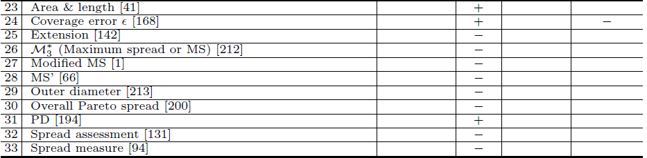
这些QIs通常考虑<u>the range formed by the extreme solutions of the set</u>(由集合的极值解构成的范围)，例如maximum spread，和它的变体[25]  [27]  [28]  [29]    [30]  [33]，或者

考虑<u>the range enclosed by the boundary solutions of the set</u>(集合的边界解所围成的范围)，实例如下图：

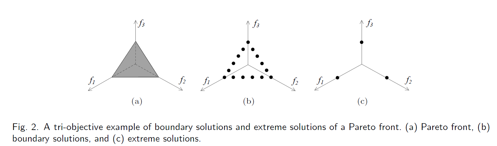

只考虑这些解的QIs可能会忽略PF的内部区域。

幸运的是，确实存在一些为解决方案集的整个覆盖范围设计的QIs。

例如，[23]测量解集的支持点的面积和长度；[24]计算解集在PF的最大不相似度；[31]将每个解与解集的其余解的不同之处相加。

### Maximum Spread (MS)

$MS(or \ \mathcal{M}_3^\*)$ 被广泛的使用于延展性indicator。它通过考虑每个目标的最大范围来度量解决方案集的范围，公式为：
$$
MS(A) = \sqrt{\sum^m_{j=1} \max_{a,a' \in A} (a_j-a_j')^2 }
$$
m 是目标函数的个数。MS应求极大值。值越高，说明的可延展性越好，在二元目标情形下，非支配解集的MS值为其两个极值解的欧氏距离。

但是，如前所述，MS只考虑集合的极值解，不能反映扩散的特性。此外，由于它不涉及集合的收敛性，远离PF的解通常对MS值有很大贡献。这很容易引起误导性的评价。例如，一个解集集中于PF的一小部分，但有一个离PF很远的离群值，那么它的MS值就很好。为了解决这一问题，引入帕累托前缘的范围作为评价的参考，例如[27] [28]。

### Extension

规定：
$$
\min_{x \in X} F(x) = (f_1(x),f_2(x),...,f_l(x))\\
U_i = \max_{x \in Pareto(U)}f_i(x)\\
L_i = \min_{x \in Pareto(U)}f_i(x)\\
i=1,...,l
$$
令：$P_r = \{ F_1^1,...,F_l^1 \}$，其中，$F_i^1=(L_1,...,L_{i-1},U_i,L_{i+1},...,L_l),[i=1,...,l]$

规定：
$$
d_r^p=\min\{ d(p_r,p)|p \in P \},p_r \in P_r
$$
因此，得表达式：
$$
EX=\sqrt{\sum(d_r^p)^2 }/l
$$
易知，$d_r^p$ 越小，说明有更好的延展性。

如果是三维图的话，$P_r$ 分别如下：

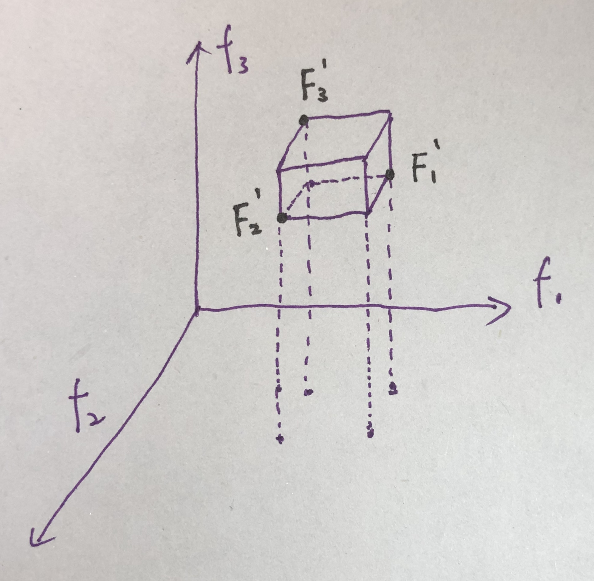


### Modified MS(勿看，瞎记的)

只有知道正常和期望的条件，才能定义和避免异常和不期望的条件，例如解在目标空间的次优区域的分散，或者收敛到感兴趣区域之外的次优解。换句话说，为了克服收敛性和多样性的矛盾要求，需要一个应用相关的尺度来定义低、理想和高多样性的近似概念，这在高维问题中尤为明显。在所提议的机制的上下文中，决策人员DM1(通常，最好是领域专家)只需要对所需折衷表面的定义极值提出近似估计。这些极值将作为包含理想的PF的超立方体的顶点。
$$
I_s = D / \left[ \sum_{m=1}^M \left( \max_{z_* \in Z_*}\{z_{*_m}\} - \min_{z_* \in Z_*} \{z_{*_m}  \}   \right)^2  \right]^{1/2}
$$
$z_t  \in Z_t$ 可以表示PF的目标集。$I_s$ 能取任何正的实数值。理想情况下，要找到一个接近统一($I_S = 1$)的指标值(理想的多样性)。小于1 ($I_S < 1$)的指示值表示与期望的解决方案的扩展相比，操作的解决方案之间的多样性较低。另一方面，指示符值大于1($I_S > 1$)突出了目标空间中解的过度分散(高多样性)。这种超空间的过度分散很可能导致解与PF的发散，并通过引入循环行为，迫使MOEA反复探索空间中以前访问过的区域，从而阻碍了优化过程。

第二个多样性管理机制是DM2，它预测NSGA-II中使用的多项式突变算子可能会使潜在的解点广泛分散。DM2试图通过引入自适应突变算子，以一种可控的方式控制这种离散。这个新的变异算子试图定义组决策变量的变异范围在每一代的基础上的多样性程度的局部non-dominated集解决方案,为每个单独的决策变量中设置,在当地的多样性以NSGA-II年代拥挤的措施。

- 计算第i代近似集的扩展指标。
- if $I_s<1$
- 在变异选择和生存选择过程中激活多样性促进机制。
- Else If $I_s \geq 1$
- 在变异选择和生存选择过程中，失活多样性促进机制。

### Coverage error  $\epsilon$

$\epsilon$ 的概念：

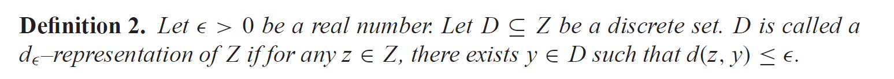

解释一下就是：有两个集合$D,Z$，$D$ 是 $Z$ 的一部分，如果想要用 $D$ 代表 $Z$，那么就要用符号 $d_{\epsilon}$ 表示。并规定，遍历 $Z$ 中的每一个点，画一个圆，半径是 $\epsilon$ ，都要有 $D$ 中的解存在，并且找最小的 $\epsilon$。

$\delta$ 的概念：

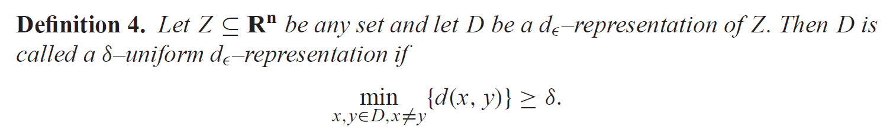

翻译一下：这个是单对 $D$ 集合来说的，$D$ 中两两点的最小距离。

例子如下：实心 + 空心 = Z；实心 = D

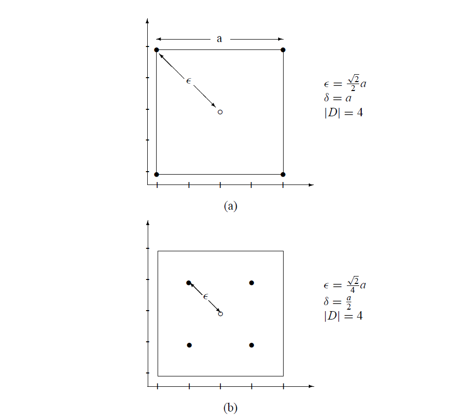

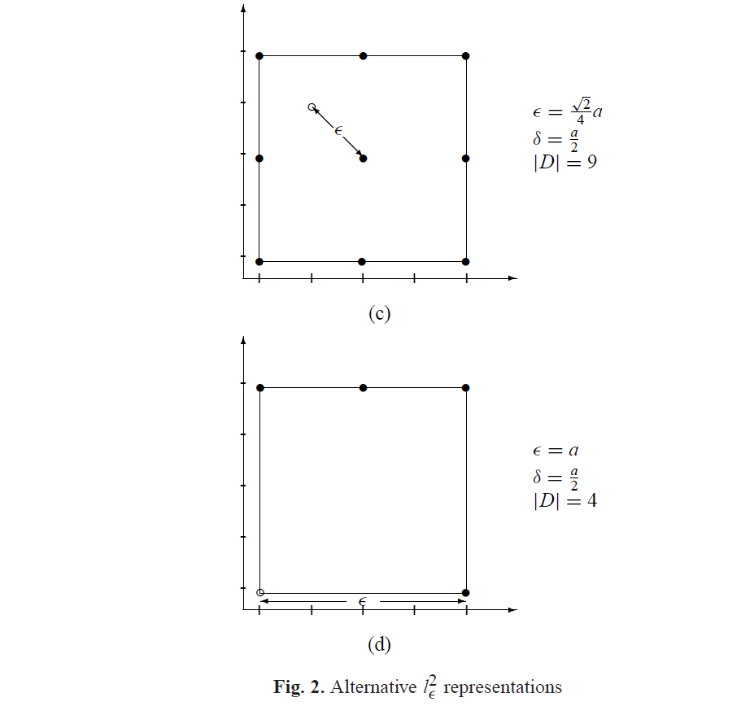

因此 $\epsilon$ 要尽可能的小，$ \delta$ 尽可能的大。
$$
\epsilon = \max_{z \in Z} \min_{x \in D} d(z,x)
$$
For a fixed element $z$ of $Z$, how well it is covered is determined by the closest point to $z$ in the representation $D$. How well the entire set $Z$  is covered depends on how well an arbitrary element of $Z$ is covered, and thus the coverage error  \epsilon$ is equal to the maximum of coverage error quantities for individual points in Z.

Similarly, the uniformity level $\delta$ is determined by the quantity.
$$
\delta=\min_{x,y \in D,x \ne y}d(x,y)
$$
the fact that $D$ is of finite cardinality, computing the uniformity level $\delta$ is simple as long as the metric $d$ is computable.

### PD

$$
PD(X) = \max_{s_i \in X}(PD(X-s_i)+d(s_i,X-s_i))
$$

where
$$
d(s,X)=\min_{s_i \in X}(dissimilarity(s,s_i))
$$
$d(s_i,X-s_i)$ 是从一个物种 $s_i$ 到另一个种群 $X$ 的相异度。

下图提供了一个方式展示了PD是如何计算的，在左图,解$s_i$和其他方案 $X−si$ 视为两个社区，他们的多样性之和是 $X−si$ (black dots)的和 与  $si$ 到 $X−si$  的相异值的和组成：

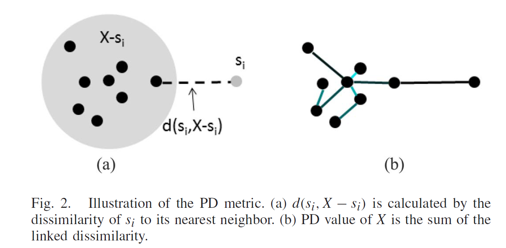

每个解与整个总体的不同之处是可以计算的，每个解都与其最近的未复制邻居相关联。然后，这些差异的和导致了整个种群的多样性，可以看作是X的结构，上右图所示，(其中较暗的线比较亮的线连接得早)。具体算法如下：

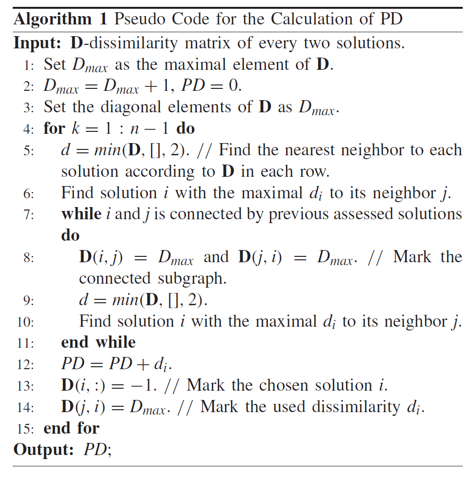

其中：

$d$ 是n*n的矩阵，例如(i,j)就是 第i个解与第j个解的p范数距离($L_p-norm$)，因此是对称矩阵。

$min(d,[],2)$ 出自于matlab语法，对每一行取最小值，因此输出是一列。

另外，这位老师居然还是我们学校的老师，在电院，好奇翻了一下个人主页，居然有代码！我会附录在本博客最后，其中中文为我注释。

不同的<u>相异</u>评价在计算PD占很重要的作用。通常采用两个解之间的距离作为它们的<u>相异</u>之处。但是请注意，欧几里得距离不太适合在高维空间中测量邻域。由于MaOPs的解分布在高维目标空间中，基于$L_2$范数的欧氏距离不适用于PD中的不相似度计算。

从下图中我们可以清楚地看到，p越小，各维$L_p$对0越敏感。相反，基于$L_p-norm-based$的距离测度不适用于测量p>1的高维数据的差异性。因此，为了测量MaOPs的多样性，需要将p设置为p < 1。已有研究表明，只要p< 1，该测度的有效性对p不敏感。因此，p在PD中不是一个参数，本文将p设为0.1。

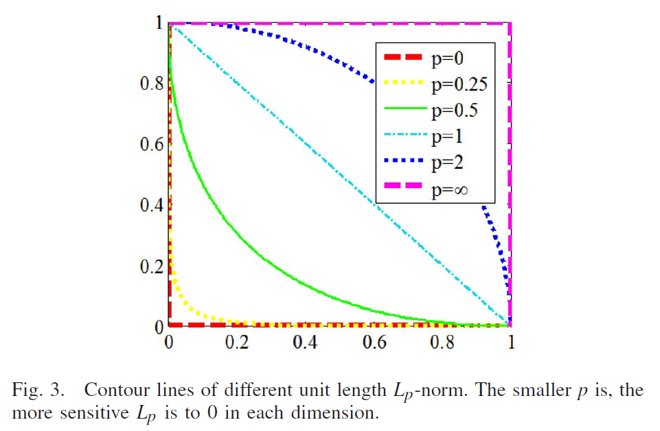

指示器使用单个标量值来描述m维分布。因此，无论哪个指标，都会丢失一些信息。因此，尽管不同的指标可能捕获不同的信息，但希望捕获一些关键信息。当得到PF f1 +f2 +f3 = 1的三个极值点时，在这三个极值点的集合中加入不同的解，多样性度量的值是不同的。下图为在三个极值点集合中加入PF的另一个解时PD、MS、NDC (b =4)、熵(b =4)的变化值，其中颜色表示矩阵的大小(颜色较深的点值小于颜色较浅的点值)。如果根据这些指标选择一个解决方案以增加多样性，下图中较亮的部分优先于较暗的部分。一旦得到极值点。MS值达到最大值。因此，没有任何解决方案能够改进MS。虽然中间部分是由NDC和熵推动的，但解在网格内是无法区分的。对于PD，中间部分提升，值不断变化。从图4可以看出，PD通常可以促进不同的解决方案。

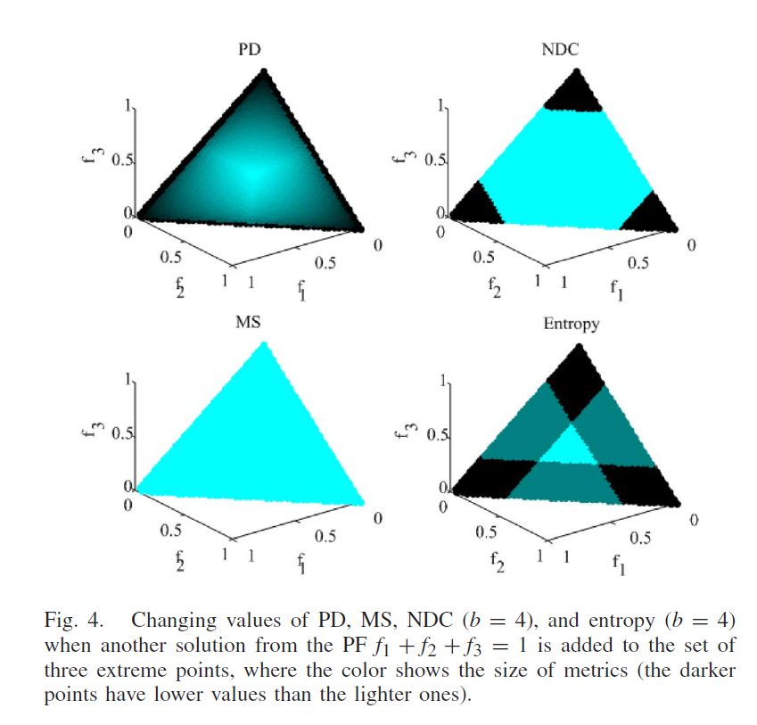

### Overall Pareto Spread

当设计的目标函数都被考虑时，总体的PF延展性度量量化了所观测的目标在目标空间中的延展能力。这个度量被定义为两个超矩形的体积比，其中一个是 $HR_{gb}$ ，它对于每一个所设计的目标的好点与坏点。类似地，  $HR_{ex}$ 定义了所观察到的Pareto解集的极值点。整个PF的延展性变为$HR_{gb}$与 $HR_{ex}$ 之比：
$$
OS(P)=\frac{HR_{ex}(P)}{HR_{gb}}
$$
$P$ 是所观测的Pareto解，$m$ 为目标函数个数，其中：
$$
OS(P)= \frac{\prod_{i=1}^{m}|\max_{k=1}^{\bar{np}} (p_k)_i -\min_{k=1}^{\bar{np}}(p_k)_i |}{\prod_{i=1}^{m}|(p_b)_i-(p_g)_i|}\\
=\prod_{i=1}^{m}| \max_{k=1}^{\bar{np}}[\bar{f_i}(x_k)] -\min_{k=1}^{\bar{np}}[\bar{f_i}(x_k)] |
$$
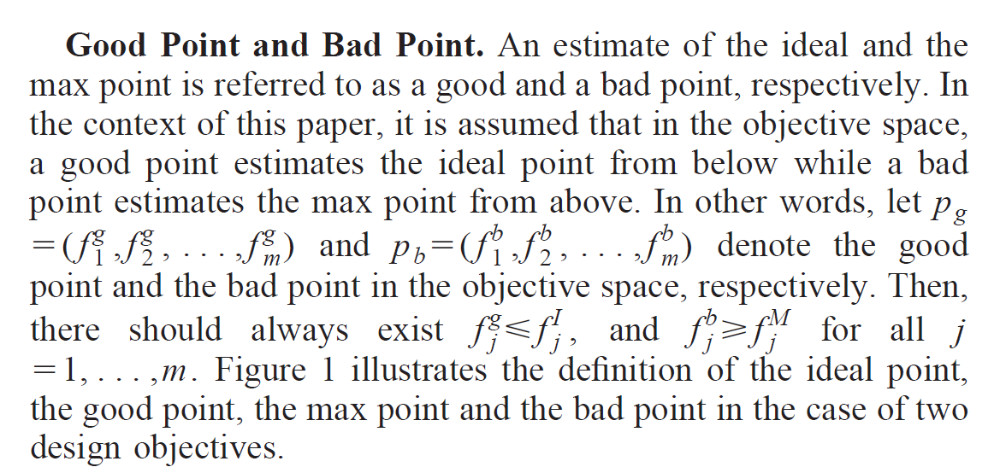

例如，在图4所示的两个目标空间中，PF-spread的计算公式为:

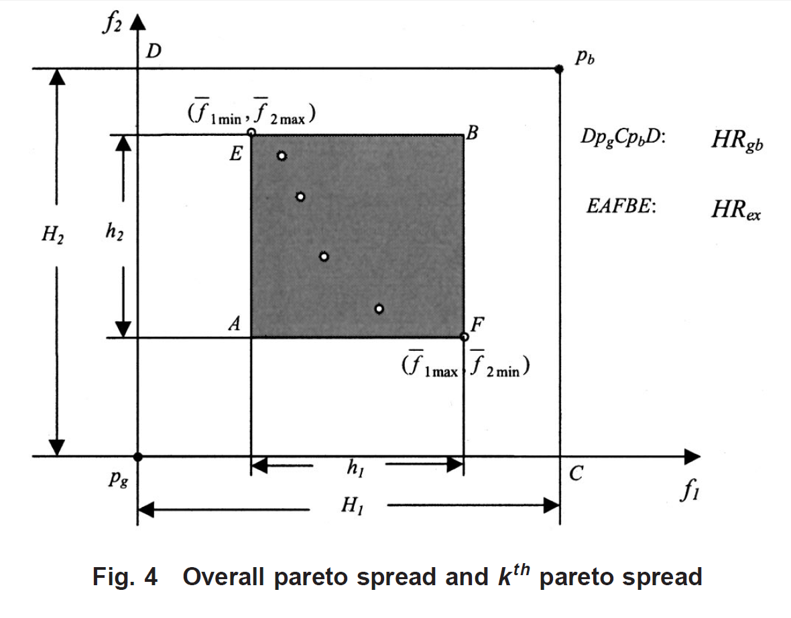
$$
OC(P) = \frac{h_1h_2}{H_1H_2}
$$
其中：

$P_1,P_2$ 是两个Pareto solution sets。if $OS(P_1)>OS(P_2)$, then the solution set P1 is preferred to P2 .
$$
h_1=|\bar{f_1}_{max}-\bar{f_1}_{min}|\\
h_2=|\bar{f_2}_{max}-\bar{f_2}_{min}|\\
H_1=|(p_g)_1-(p_b)_1|\\
H_2=|(p_g)_2-(p_b)_2|
$$


### PD's code

```matlab
% Authors:    Handing Wang, Yaochu Jin, Xin Yao
% University of Surrey, UK, and University of Birmingham, UK
% EMAIL:      wanghanding.patch@gmail.com, yaochu.jin@surrey.ac.uk, X.Yao@cs.bham.ac.uk
% WEBSITE:    http://www.surrey.ac.uk/cs/people/handing_wang/
% DATE:       March 2016
% ------------------------------------------------------------------------
% This code is part of the program that produces the results in the following paper:
% Handing Wang, Yaochu Jin, Xin Yao, Diversity Assessment in Many-Objective Optimization, Cybernetics, IEEE Transactions on, Accepted, 10.1109/TCYB.2016.2550502.
% You are free to use it for non-commercial purposes. However, we do not offer any forms of guanrantee or warranty associated with the code. We would appreciate your acknowledgement.
% ------------------------------------------------------------------------
function [ pd ] = PD( X )
% Usage: [ pd ] = PD( X )
%
% Input:
% X             -Objective values of the population n*m (n solutions with m objectives)
%
% Output: 
% pd            -PD value of population X
%
p=2;%lp norm setting0.1
C=zeros(size(X,1),size(X,1));%connection array
D=zeros(size(X,1),size(X,1));%dissimilarity array
%Calculate the dissimilarity between each two solutions
for i=1:size(X,1)-1
    for j=i+1:size(X,1)
       d=sum(abs(X(j,:)-X(i,:)).^p,2).^(1/p);
       D(i,j)=d;
       D(j,i)=d;
    end
end
DMAX=max(max(D))+1;
D(logical(eye(size(D))))=DMAX;
n=size(X,1);
pd=0;

for k=1:n-1
    %Find the nearest neighbor to each solution according to D in each row.
    [d,J]=min(D,[],2);
    %Find solution i with the maximal di to its neighbor j
    [dmx,i]=max(d);

    while liantong(C,i,J(i))==1 %i and j are connected by previous assessed solutions
        if D(J(i),i)~=-1
            D(J(i),i)=DMAX; %Mark the connected subgraph
        end
        if D(i,J(i))~=-1
            D(i,J(i))=DMAX;
        end
        [d,J]=min(D,[],2);
        %Find solution i with the maximal di to its neighbor j
        [dmx,i]=max(d);
    end
    C(J(i),i)=1;
    C(i,J(i))=1;
    pd=pd+dmx;
    if D(J(i),i)~=-1
        D(J(i),i)=DMAX;%Mark the used dissimilarity di.
    end
    D(i,:)=-1;%Mark the chosen solution i
end
end

function [w]=liantong(C,I,J)
% Usage: [w]=liantong(C,I,J)
%
% Input:
% C             -Connection array
% I             -index I
% J             -index J
%
% Output: 
% w             -1 if solutions I and J are connected, 0 if solutions I and J are not connected.
%
V=I;
Child=find(C(V,:)==1);
if isempty(find(Child==J))==0  % 直接连接
    w=1;
    return
else
    C(V,:)=0;  % 删掉点I
    C(:,V)=0;
    for i=1:size(Child,2)  % 遍历连接点I的其他点
        w=liantong(C,Child(i),J); % 进行递归
        if w==1
            return
        end
    end
end
w=0;
end

```


