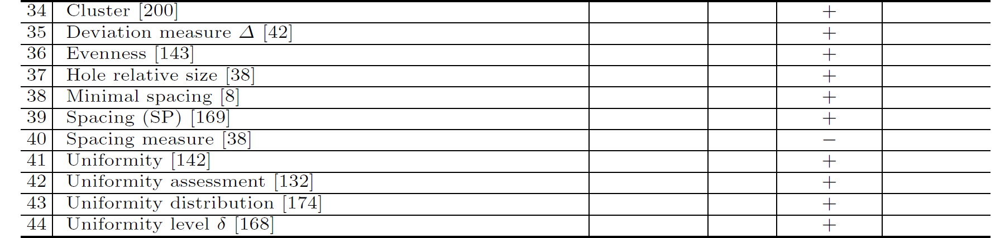
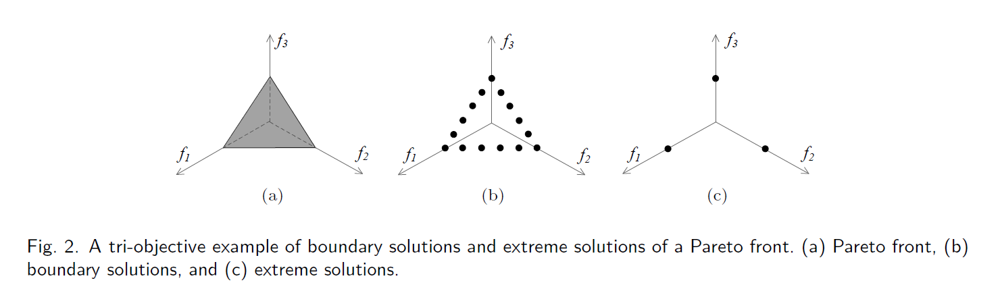
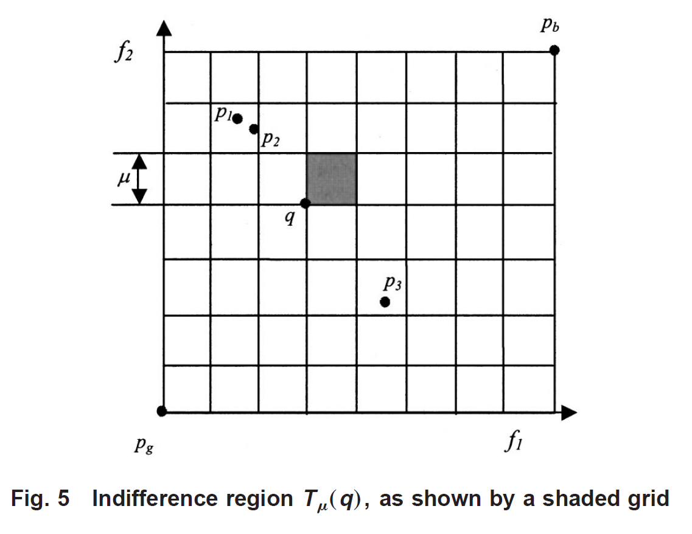

又看了好几天的剧。。。罪恶感啊

<!--more-->

### 介绍

均匀性的质量指标衡量集的解分布的均匀程度。由于解集的质量可以看作是其表示PF的能力，所以一个均匀分布的解集比一个非均匀分布的解集提供更好的帕累托前沿表示，可以认为它具有更好的质量。理想的均匀性QI应该排在由完全相等的解组成的集合的最高位置，对这个集合的一点干扰会导致更糟糕的评估结果。具体的indicators如下:

通常可以通过<u>测量解之间距离的变化</u>来评价解集的均匀性。这个类中的许多QIs都是按照这些思路设计的，例如，$spacing(SP)$[39],$deviation \ measure \Delta$[35] , $ uniformity \ distribution$[43], $\ minimal \ spacing$[38], $ spacing \ measure$[37] 和$uniformity$[41]。

其他则考虑解之间的<u>最大最小距离</u>[40 36 44]，和<u>构建集群</u>[34]或<u>最小生成树</u>[42]。

### Minimal spacing

#### 前言

先介绍spacing：
$$
S=\sqrt{\frac{1}{|Q|} \sum_{i=1}^{|Q|}(d_i-d)^2 }
$$

- $d_i=min_{k\in Q\ and\ k \ne i}\sum_{m=1}^M|f_m^i-f_m^k|$ 。离$Q_i$最近的点的距离，距离公式每一维度(目标函数)的差值的平均值。
- $f_m^i$：在最后的非支配解$Q$中第$i$个解的第$m$个目标函数值。
- $d$：所有$d_i$的平均值。

$S$越接近0越说明解集是更加的均匀分布的帕累托最优前沿。

但此算法在上图所示中便展现出缺点：

可以直观的看出fig(b)的一致性比fig(a)要好，但通过公式却体现出相反的结论。

原因：离a最近的是b，离b最近的a，离c最近的是d，离d最近的是c。那么S值一定比fig(b)的低。而忽略了fig(a)中b与c之间很大的距离。

#### 正文

此算法更像是一个流程，总结下来就是把每个解看成一个点，每一个点只访问一次，求把所有点连起来的距离总和的最小值。

1. 把所有点设为unmarked状态，随机找一个解，作为seed，此点变为marked。
2. 在所有的unmarked点中，找到离刚刚设为marked/seed点最近的点。此点设为marked，
3. 依次循环(2)，直至所有点均是marked，并记录路径的距离和。
4. 把每个点都作为seed，取路径和最小。最后再处以$|Q|-1$

其中，由于每个目标函数的性质可能不同，他们的取值范围也就可能不同，距离公式归一化修改为：
$$
d_i=\frac{1}{|F^{max}_m-F^{min}_m|}min_{k\in Q\ and\ k \ne i}\sum_{m=1}^M|f_m^i-f_m^k|
$$
$F^{max}_m$，$F^{min}_m$第m个目标的最大值和最小值。

如此算法,易得fig(b)的值会比fig(a)更小，更有效！

### Spacing(SP)

SP 测量一组解集之间解的距离变化。特别的，$A = \{a_1,a_2,...,a_N \}$,
$$
SP(A)=\sqrt{\frac{1}{N-1} \sum^N_{i=1} (\bar{d} - d_1(a_i,A/a_i))^2 }
$$
其中：

$\bar{d}$ 是所有 $d_1(a_1,A/a_1)$ $d_1(a_2,A/a_2)$ $d_1(a_2,A/a_2)$,..., $d_1(a_N,A/a_N)$ 的平均值，$d_1(a_i,A/a_i)$ 是 $a_i$ 对 $A/a_i$ 的一范数(Manhattan distance)，
$$
d_1(a_i,A/a_i)=\min_{a \in A/a_i} \sum_{j=1}^m|a_{ij}-a_j|
$$
$m$ 是目标函数的个数，$a_{ij}$ 是第 $a_i$ 的解的第 $j$ 个目标的值。SP被最小化;数值越低，均匀性越好。SP值为0表示解集的所有成员在曼哈顿距离的基础上间距相等。请注意，SP仅测量解决方案的“邻域”分布。即使与MS一起工作，SP也不能涵盖集合的多样性质量，尽管这两个指标在文献中经常一起使用来达到这一目的。以下图为例，图2(b)和(c)中的解集均采用SP和MS满分;然而，它们分别位于帕累托前沿的边界和极端点。

### Spacing metric

假设有两个目标函数，
$$
spacing = \left[ \frac{1}{N-1}\sum_{i=1}^{N-1}(1 - \frac{d_i}{\bar{d}}) \right]
$$
为了计算$d_i$，我们考虑第一个目标，将$PPF$中的所有点按升序排序。接下来，为了计算$d_i$，我们使用下面的公式:
$$
d_i = \sqrt{(f_1(\vec{x_i} )-f_1(\vec{x_i+1}) )^2+((f_2(\vec{x_j} )-f_2(\vec{x_j+1}) )^2}
$$
$\bar{d}$ 便为 $d_i$ 的和的平均值。 

### Deviation measure $\Delta$

由于优化解的多样性是多目标优化中的一个重要问题，我们设计了一种基于最终总体中最优非支配前沿解之间连续距离的度量方法。将得到的第一组非优解与均匀分布进行比较，计算偏差如下:(这个有特殊的背景才可适用)
$$
\Delta = \sum_{i=1}^{|\mathcal{F}_1|}\frac{|d_i-\bar{d}|}{|\mathcal{F}_1|}
$$
$\mathcal{F} = \{ \mathcal{F}_1,\mathcal{F}_2,... \}$ 是所有的非支配前沿。

为了确保这种计算考虑到解在真实前沿的整个区域的扩散，我们将边界解包含在非主导锋$\mathcal{F}_1$中。对于离散的帕累托最优前沿，我们为每个离散区域计算上述度量的加权平均值。在上式中，$d_i$是目标函数空间中最终总体的第一非支配前沿上两个连续解之间的欧式距离。参数$\bar{d}$是这些距离的平均值。

### Cluster ($CL_\mu$)

需要先介绍 Number of Distinct Choices ($NDC_\mu$).

#### $NDC_\mu$

从设计者的角度来看，所观察到的帕累托解集中包含的点越多，可供选择的设计选项就越多。然而，如果观测到的帕累托解在目标空间中过于接近，那么对于设计者来说，观测到的帕累托解之间的变化可能无法区分。换句话说，观察到的帕累托解的数量越多，并不一定意味着设计选择的数量越多。简而言之，对于一个观察到的帕累托解集$p=(p_1,...,p_{\bar{np}})$ ，只有那些彼此之间有足够差异的解决方案才应被视为有用的设计选项。

设数量$\mu , \ (0 < \mu <1)$为设计人员指定的数值，可将m维目标空间划分为$1/\mu^m$的小网格。为了简单起见，将$1/\mu$作为整数。每个网格都是指一个正方形(m维中的超立方体)，即无差异区域$T_{\mu(q)}$，其中区域内任意两个解点$p_i$和$p_j$都被认为是相似的，或者设计人员对这些解不感兴趣。下图给出了二维目标空间中的量$\mu$ 和 $T_{\mu(q)}$。

$T_{\mu(q)}(q,P)$ 表示是否有任何点$p_k \in P$属于区域$T_{\mu}(q)$。当至少有一个解点$p_k$落在无差异区域$T_{\mu}(q)$中时，$T_{\mu(q)}(q,P)$等于单元(或1)。$T_{\mu(q)}(q,P)$等于0(或0)只要$T_{\mu}(q)$区域没有解。一般来说，$T_{\mu(q)}(q,P)$可以表述为:
$$
T_{\mu(q)}(q,P) = \begin{cases}
1 & \exists p_k \in P \ p_k \in T_\mu(q)\\
0 & \forall p_k \in P \ p_k \notin T_\mu(q)
\end{cases}
$$
质量度量$NDC_{\mu}(q)$，即预先指定的m值的不同选择的数量，可以定义为:
$$
NDC_{\mu}(P)=\sum_{l_m=0}^{v-1}...\sum_{l_2=0}^{v-1}\sum_{l_1=0}^{v-1}NT_\mu(q,P)
$$
where $q = (q_1,q_2,...,q_m)$ with $q_i=\frac{l_i}{v} $ 

其中，$v=1/\mu$ ，点 $q$ 位于目标空间m-网格线的任意交点上，坐标为$(q_1,q_2,…,q_m)$。如本节开头所示，，如果想让$NDC_{\mu}(P)$值较高的观察到的Pareto解集，对于预先指定的 $\mu$ 就要有相对于较低的值(网格越密，被删去的点就越少)。

#### 正文

上一节的质量度量，即 $NDC_{\mu}(P)$。然而，仅使用这个质量度量，无法正确解释集群现象。例如，假设有一个预先指定的m值，观察到的Pareto解集$P_1$提供了10个不同的解，有$NDC_{\mu}= 10$。现在假设，这里有另一组解$P_2$ 它提供了100个解，$NDC_{\mu}=10$ 。可以看出，设计人员并不希望看到解决方案集P2，因为该集中的许多解决方案可能是集群的。因此，引入了质量度量集群$CL_\mu(P)$:
$$
CL_\mu(p)=\frac{N(P)}{NDC_\mu(P)}
$$
其中$N(P)$为观察到的帕累托解的个数。在理想情况下，得到的每一个帕累托解都是distinct的，那么数量$CL_\mu(p)$的值等于1。在所有其他情况下，$CL_\mu(p)$都大于1。此外，集群数量$CL_\mu(p)$的值越高，解决方案集的集群化程度就越高，因此解决方案集的受欢迎程度就越低。

### Hole relative size

当我们看到这组度量标准，特别是间距度量(spacing metric)标准时，我们意识到它们有时在显示沿帕累托边界(帕累托边界上的一个洞)的点分布的不连续时是不准确的。因此，为了克服这个缺点，我们设计了一种新的度量，称为孔相对大小(hr)。

HRS度量允许计算沿帕累托边界分布的点的最大孔的大小。然后用孔的大小除以点与点之间的平均间距进行归一化。如下所示：
$$
HRS = \frac{\max_i d_i}{\bar{d}}
$$
$d_i$ 两个相邻解的距离。 $\bar{d}$ 点间的平均距离。

这个度量比间距度量提供的信息更多，但是，在尝试规避间距度量中的一个缺点时，我们在HRS度量中引入了另一个缺点:它不能在不连续的帕累托边界上工作。事实上，不连续的帕累托边界有天然的漏洞。因此，对于帕累托边界上的固定数量的解，HRS度规总是以高概率测量相同的值。因此，我们建议在不连续测试问题中不要使用这个度量。

### Uniformity assessment(没看懂，心力憔悴)

